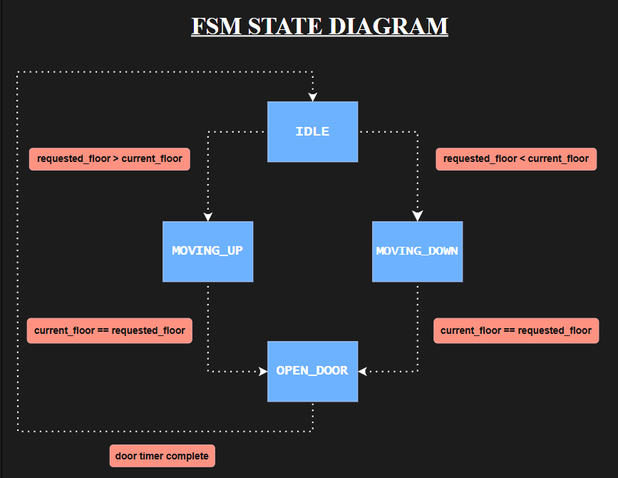
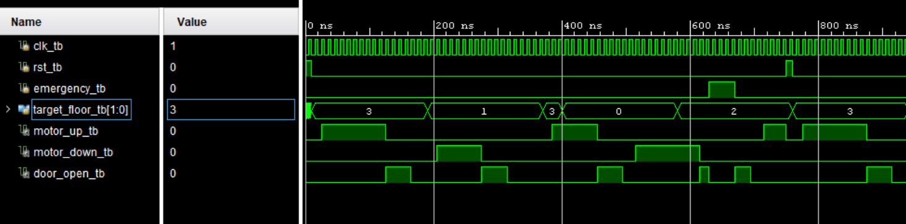
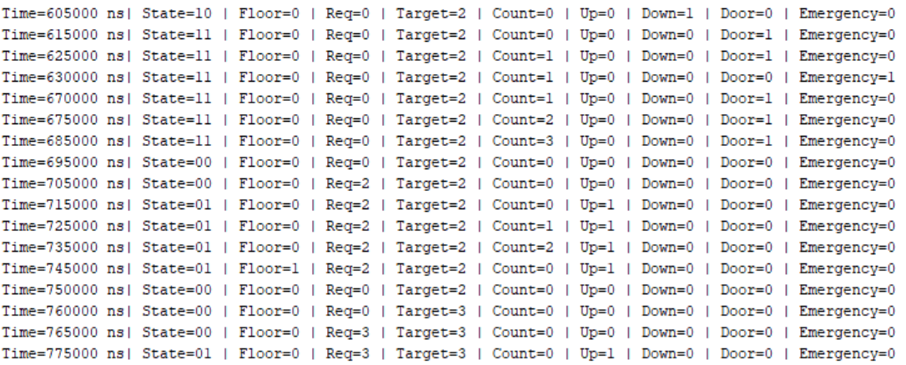
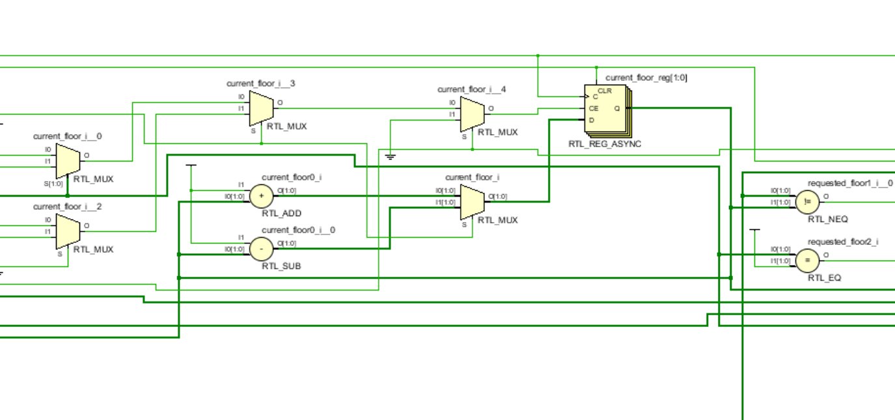
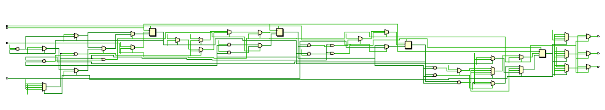

# 4-Floor Elevator Controller (FSM Design)

## 1. Overview
A 4-Floor Elevator Controller designed in Verilog HDL, implemented using a Moore Finite State Machine (FSM). The design simulates real-world elevator behavior using synchronous sequential logic. The controller operates through four states: `IDLE`, `MOVING_UP`, `MOVING_DOWN` and `OPEN_DOOR`. The state transitions occur on the rising edge of the clock, while an asynchronous reset allows immediate system initialization and emergency handling.

This project helped strengthen my understanding of sequential circuits, FSM design and clocking mechanisms.

## 2. Features & Assumptions
### Features
- Moore FSM-based control architecture
- Supports elevator operation across 4 floors (0–3)
- Four operating states: `IDLE`, `MOVING_UP`, `MOVING_DOWN`, and `OPEN_DOOR`
- Clock-driven state transitions for reliable operation
- Upward and downward motor control signals
- Current floor tracking and target floor comparison
- Emergency handling through asynchronous reset
- Verified using a dedicated testbench and waveform analysis in Xilinx Vivado

### Assumptions
- The controller handles one floor request at a time.
- Floor requests are not queued.
- The passenger is assumed to be inside the elevator before a floor request is generated.

## 3. Signals and Registers
This section describes the input, output, and internal registers used in the elevator controller.
| Name | Type | Width | Description |
|:-----:|:----:|:-----:|:----------:|
| `clk`| Input | 1 bit | System clock used for state transitions. |
| `rst`| Input | 1 bit | Asynchronous reset signal. |
| `emergency` | Input | 1 bit | Stops elevator operation and disables outputs. |
| `target_floor` | Input | 2 bits | Requested destination floor (0–3). |
| `motor_up` | Output | 1 bit | Indicates upward movement. |
| `motor_down` | Output | 1 bit | Indicates downward movement. |
| `door_open` | Output | 1 bit | Indicates that the door is open.|
| `state` | Register | 2 bits | Stores the current FSM state. |
|`next_state` | Register | 2 bits | Stores the next FSM state. |
|`current_floor` | Register | 2 bits | Tracks the elevator's current floor. |
|`requested_floor`| Register | 2 bits | Stores the active floor request until it is completed.|
|`counter` | Register | 2 bits | Provides movement and door timing delays. |


## 4. FSM Working Principle
The elevator controller consists of four states:
- `IDLE`
- `MOVING_UP`
- `MOVING_DOWN`
- `OPEN_DOOR`

The controller begins in the `IDLE` state, where it waits for a floor request. When a request is received, the input value is stored in an internal register `requested_floor`. This ensures that the elevator completes the current request even if the external `target_floor` input changes during operation.

The controller compares `requested_floor` with `current_floor` to determine the direction of movement. Based on this comparison, the state transitions to either `MOVING_UP` or `MOVING_DOWN`. 

The elevator remains in the corresponding movement state until the destination floor is reached. Upon reaching the requested floor, the FSM enters the `OPEN_DOOR` state. After the door operation is completed, the controller returns to the `IDLE` state and waits for the next request.

To simulate realistic elevator behavior, a delay of three clock cycles is introduced between floor transitions, while the door remains open for four clock cycles before closing.

Since the controller follows the Moore FSM model, the output signals depend only on the current state and are independent of the input signals.

### State Diagram


## 5. Implementation and Results
### Waveform Analysis


### Console Output Excerpt


### RTL Schematic Zoomed View


### Complete RTL Schematic


## 6. Project Structure
```
4-Floor-Elevator-Controller/
├── src/
│   └── Elevator_controller_4_floors.v
├── tb/
│   └── Elevator_controller_4_floors_tb.v
├── doc/
│   ├── state_diagram.png
│   ├── waveform.png
│   ├── console.png
│   ├── schematic_zoomed.png
│   └── detailed_schematic.png
└── README.md
```

## 7. Key Learnings
- Understood the differences between Moore and Mealy FSMs and practically implemented a Moore FSM design.
- Learned how to divide an FSM design into sequential, combinational, and output logic blocks.
- Understood the behavioral difference between synchronous and asynchronous reset.
- Gained practical experience in implementing timing delays using counters.
- Understood the importance of non-blocking assignments (`<=`) in sequential logic to ensure simultaneous register updates and avoid unintended behavior.
- Understood the importance of internal registers for storing information independently of external inputs.
- Improved debugging skills through the analysis of console outputs, waveforms, and RTL schematics.

## 8. Tools & Concepts Used
- **Language:** Verilog HDL
- **EDA Tool:** Xilinx Vivado (Simulation + Synthesis)
- **Concepts Used:** Moore FSM design, synchronous sequential circuits and clocking mechanism.
